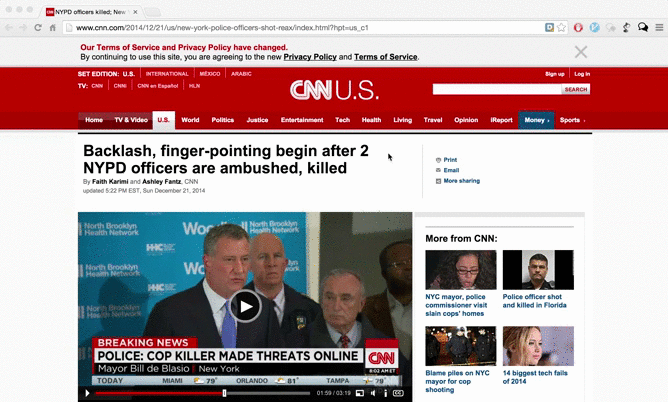

# FoundYa

Chat with people browsing a similar web page to yours

To watch a longer demo click here: [FoundYa Demo](http://youtu.be/kDOvchyLKYM)

## Description

FoundYa makes browsing the internet a social experience. FoundYa is a Chrome extension that connects users browsing similar web pages and enables them to chat with each other.

The url each user visits is resolved to a categorical chatroom based on its content using the [Alchemy API](http://www.alchemyapi.com/) for URL Taxonomy. Users assigned to the same chatroom are connected and can immediately start chatting with each other.

## Motivation / Use Cases

Although billions of people use modern browsers and there are thousands of social networking sites, browsing non social networking sites is in general a non social experience. The only social aspect of browsing for example a news article is the ability to post comments to the bottom of the article. However, this is limited only to the article on that specific website. Also the experience is far from the real-time experience of a conversation or a chat.

In addition people browsing some url are interested in general in the topic of that url. These users are highly likely to have many commonalities with each other. Therefore connecting these users can enable them to:
- Discuss a particular page/part of a website with others
- Meet new people

## Client-Side

The client-side was implemented as a Chrome extension using:
- HTML
- CSS
- JavaScript

## Server-Side

The application was deployed using AWS - Elastic Beanstalk. User login and message exchange is implemented by using an Amazon AWS RDS database. Finally the url each user is browsing is categorized by using the [Alchemy API](http://www.alchemyapi.com/) for URL Taxonomy.

